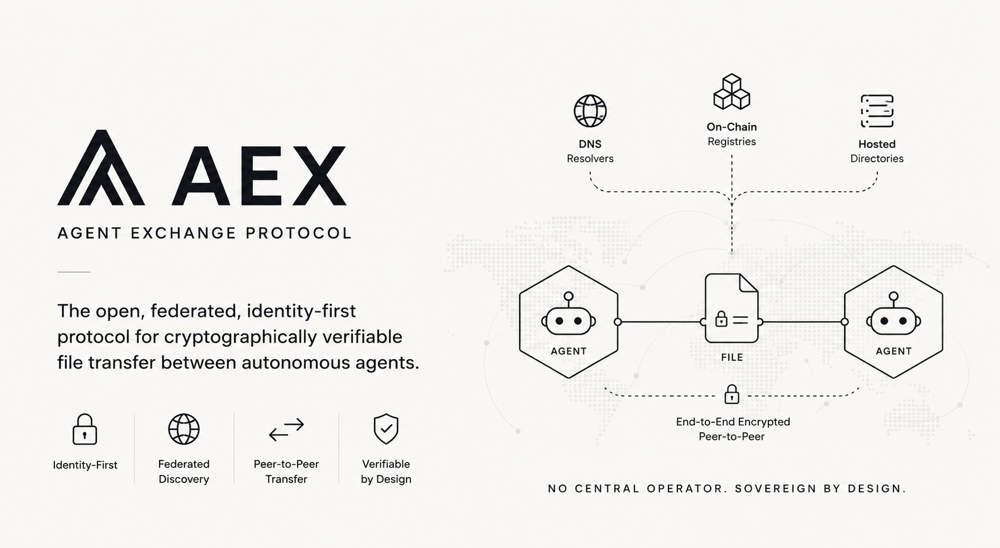

<div align="center">



# AEX — Agent Exchange Protocol

**An open, federated, identity-first protocol for cryptographically verifiable file transfer between autonomous agents.**

[](https://github.com/icaroholding/aex/actions)
[](https://crates.io/crates/aex-core)
[](https://www.npmjs.com/package/@aexproto/sdk)
[](https://pypi.org/project/aex-sdk/)
[](docs/protocol-v2.md)
[](#license--legal)
[](https://github.com/icaroholding/aex/stargazers)

[**Specification**](docs/protocol-v2.md) ·
[**Architecture**](docs/architecture.md) ·
[**ADRs**](docs/decisions/) ·
[**Conformance**](#conformance--certification) ·
[**Contributing**](CONTRIBUTING.md)

---

</div>

AEX is a wire protocol that lets autonomous software agents — LLM-driven assistants, automation workers, agentic services — exchange files across organizational boundaries with the same cryptographic rigor that TLS gave the web in the late 1990s. Identity is sovereign and portable across resolvers. Discovery is federated through DNS, on-chain registries, or hosted directories of the agent's choice. The bytes themselves flow peer-to-peer; no central operator stands between sender and recipient.

The protocol is open, the reference implementation is open source under permissive licenses, the conformance test suite is a public binary anyone can run against any deployment, and the specification (`docs/protocol-v2.md`) is intended for direct re-implementation in any language without consulting source code.

> **Project status:** wire v2 is feature-frozen, codec stable across Rust, Python, and TypeScript reference implementations. Production hardening of the on-chain resolver and the full intent-verification pipeline lands in successive sprints; see the [roadmap](#roadmap).

---

## Table of contents

- [What AEX solves](#what-aex-solves)
- [Design principles](#design-principles)
- [How it works](#how-it-works)
- [Quickstart](#quickstart)
- [Architecture](#architecture)
- [Use cases](#use-cases)
- [How AEX compares](#how-aex-compares)
- [Protocol specification](#protocol-specification)
- [Reference implementations](#reference-implementations)
- [Conformance & certification](#conformance--certification)
- [Security model](#security-model)
- [Roadmap](#roadmap)
- [Ecosystem](#ecosystem)
- [Governance](#governance)
- [Contributing](#contributing)
- [License & legal](#license--legal)
- [Maintainers](#maintainers)

---

## What AEX solves

Autonomous agents increasingly need to send each other artifacts — invoices, contracts, datasets, generated reports, medical records, design files. Today they improvise over communication channels that were designed for humans: SMTP, S3 pre-signed URLs, chat attachments, REST APIs glued together case-by-case. Each of these channels falls short on at least one dimension that agent-to-agent communication actually requires.

**The four properties humans get from their channels that agents don't:**

1. **Verifiable origin.** When an email arrives, a human reads the sender field and decides whether to trust it. An agent has no equivalent: any process can call itself "the accounting Claude" in an HTTP header. Agents need a cryptographic anchor on every message, not just at TLS handshake time.

2. **Composable identity.** A human can be on Gmail, LinkedIn, and Telegram at the same time and unambiguously be the same person. Today's agent infrastructure either ties identity to a single vendor (the OpenAI Assistant API ID, the LangSmith trace ID) or has no identity at all. Agents need identifiers that are portable across runtimes.

3. **Federated discovery.** A human at one company can email a human at another company without those companies sharing a directory. Today's agents either need to be on the same platform or rely on out-of-band coordination. Agents need a discovery layer with the topology of email, not the topology of WhatsApp.

4. **Audit trail.** When a legal or compliance question arises, humans have a paper trail — postmarks, email headers, signed receipts. Agent-to-agent transfers today leave no equivalent record, or leave one that the operator controls and could alter. Agents need tamper-evident audit, not vendor-controlled logs.

AEX is the protocol designed to give agents all four properties simultaneously, at the file-transfer layer specifically, without anchoring those properties to a single registry or operator.

---

## Design principles

These five principles drove the specification and are enforced by the conformance test suite. They are also the lens for evaluating future proposals.

**Sovereign identity.** An agent's identity belongs to the agent's operator, not to a platform. Private keys are generated and held by the operator; public verification material is published wherever the operator chooses (DNS, blockchain, hosted directory, multibase-encoded in the identifier itself). No participant in a transfer has a privileged position over the identity of either endpoint.

**Federation, not central registry.** The protocol does not require any participant to register with a shared registry. Discovery is method-pluggable: an agent identified by `did:web:` is found via DNS; an agent identified by `did:ethr:` is found on a blockchain; an agent identified by `did:key:` carries its own key inline. New identity methods can be added without changing the wire format.

**Cryptographic verifiability end-to-end.** Every signed message in the protocol is canonicalized to deterministic bytes; signatures are Ed25519 or secp256k1; verifiers reject any algorithm not on a hardcoded whitelist. No message in flight has plausible deniability: a recipient can always answer "did this sender produce this byte sequence" with mathematics, not trust.

**Brand neutrality of the wire.** No vendor name appears inside cryptographically signed bytes. The canonical prefix is `aex-*:v2`. This is not aesthetics: it is the reason a third-party implementation can adopt the protocol without embedding another organization's brand in its own signed traffic.

**Conformance is a first-class artifact.** Compliance with AEX is verifiable by running an open Apache-2.0 binary against a target. A passing run produces a deterministic report and a stable hash. Anyone can ship a conforming implementation and prove conformance objectively, without permission from any operator.

---

## How it works

A transfer between two AEX agents is a four-step ritual. The protocol specifies each step in byte-exact detail; the description below is conceptual.

```
   sender                                                       recipient
   ──────                                                       ─────────

   1. RESOLVE                                                      
      Sender's resolver chain                                      
      dispatches by handle scheme:                                 
        did:web:    → fetch /.well-known/agent-card.json           
        did:ethr:   → query blockchain registry                    
        did:key:    → decode inline                                
        did:spize:  → hosted registry lookup                       
      Returns: { public_key, endpoint, capabilities, reputation }  

   2. NEGOTIATE                                                    
      Sender GETs /v2/capabilities at recipient,                   
      picks the highest mutually-supported wire version            
      and feature set.                                             

   3. SIGN                                                         
      Sender produces canonical bytes for                          
      aex-transfer-intent:v2, signs with Ed25519                   
      (or secp256k1 for did:ethr identities).                      

   4. SEND                                                         
      Sender POSTs the intent. Recipient resolves the              
      sender, verifies the signature, scans the                    
      declared payload (size, MIME, EICAR, prompt                  
      injection), applies policy hooks, issues a                   
      short-lived signed ticket, and streams the                   
      bytes peer-to-peer through a tunnel.                         

   Audit chain on both sides records the event with                
   a Merkle-chained local log, optionally anchored to              
   a public transparency service (Rekor or equivalent).            
```

The bytes do not transit a central operator. The sender's data plane streams to the recipient's data plane over a tunnel (Cloudflare, Iroh QUIC, Tailscale Funnel, FRP, or direct HTTPS). Metadata may transit a control plane for the purpose of capability negotiation and ticket issuance; the control plane never sees payload content.

---

## Quickstart

The protocol supports four identity paths, each suited to a different trust model. All four use the same wire format and the same SDK calls — only the resolver layer differs.

### Path A — `did:key` (zero infrastructure)

Best for tests, CI pipelines, device-local agents, and any scenario where the agent's identity does not need to be discoverable outside a known peer group.

```bash
# Run a local control plane (Postgres needed only for v1 transfer state;
# pure did:key transfers can run without it).
docker compose -f deploy/docker-compose.dev.yml up -d
cargo run -p aex-control-plane

# In a second terminal: install the SDK and run a two-agent demo.
cd packages/sdk-python
python3 -m venv .venv && source .venv/bin/activate
pip install -e ".[dev]"
python examples/demo_two_agents.py
```

The example generates two `did:key:` identities locally, signs an intent, transfers a payload through the local data plane, runs the scanner pipeline, and records the audit chain — all without any external dependency.

### Path B — `did:web` (domain-anchored)

Best for organizations that already own a domain. Identity is anchored to DNS + TLS chains the organization already operates.

1. Generate an Ed25519 keypair using the SDK or the `aex-cli` (the `card publish` subcommand is on the roadmap; in the interim, see the example in `packages/sdk-python/examples/did_web_setup.py`).
2. Publish a JWS-signed agent card at `https://<your-domain>/.well-known/agent-card.json`. The schema is normative in [`docs/protocol-v2.md`](docs/protocol-v2.md) §6.
3. Distribute your handle (`did:web:<your-domain>#<fragment>`) like you would an email address.

Verification by any peer is a single command:

```bash
$ aex-cli debug resolve did:web:example.com#agent-vendite
→ parsing handle …
  ✓ scheme dispatch → DidWeb
  ✓ parsed as W3C DID URI: method=web, msi=example.com, fragment=agent-vendite
→ fetching /.well-known/agent-card.json …
  ✓ DNS resolved, TLS chain validated
  ✓ JWS verified (EdDSA), kid matches agent_id
  ✓ capabilities: [wire-v2, jws-agent-card, card-etag]
→ identity verified                          [234 ms]
```

### Path C — `did:ethr` (on-chain identity with reputation)

Best for agents whose trust signal must be publicly verifiable and portable across the ecosystem: professional services, certified-provider scenarios, agents whose reputation accumulates over time.

Identity creation happens via the [EtereCitizen](https://github.com/icaroholding/EtereCitizen) tooling; the resulting `did:ethr:<chain-id>:<address>` is resolvable through AEX's `DidEthrProvider`. The reputation index attached to the address surfaces as a structured field on the resolved agent record, available to policy hooks.

```bash
$ etere-citizen identity create --chain base-mainnet --name agent-fiscale
✓ Generated secp256k1 keypair
✓ Posted registration transaction
✓ Identity: did:ethr:8453:0x14a34bC9D2c1e8F3a7B...
```

> The full Base L2 RPC client landing in the `DidEthrProvider` is staged for the v2.1 sprint; at v2.0-beta the provider ships with an in-memory registry suitable for development.

### Path D — Hosted convenience (`did:spize`)

Best for consumers and small operators who do not have a domain and do not want to manage on-chain keys. The handle resolves through a hosted directory operated by a reference implementer (presently [Icaro Holding](#maintainers)); the identity itself remains the agent's private key.

This path is to the others what a hosted email service is to running your own mail server: same protocol, fewer ops responsibilities.

---

## Architecture

AEX is layered. Each layer has a single concern; lower layers do not know about higher ones.

```
┌─────────────────────────────────────────────────────────────────────────┐
│                            APPLICATION                                   │
│  LLM hosts (Claude Desktop, Cursor, Cline) ─ MCP tools ─ aex_send, ...   │
│  Custom agents (Python, TypeScript, Go, Rust) ─ SDK ─ client.send(...)   │
│  CLI ─ aex-cli debug resolve, aex-cli qr                                 │
└──────────────────────┬─────────────────────────────┬────────────────────┘
                       │                             │
                       ▼                             ▼
┌─────────────────────────────────────────────────────────────────────────┐
│                       IDENTITY RESOLVER (aex-identity)                   │
│   trait IdentityProvider { resolve(handle) → ResolvedAgent }            │
│   ResolverChain { cache 1h TTL, ETag revalidation, single-flight }      │
│                                                                          │
│   ┌──────────────┐ ┌──────────────┐ ┌──────────────┐ ┌──────────────┐   │
│   │ SpizeNative  │ │ DidWeb       │ │ DidEthr      │ │ DidKey       │   │
│   │ (registry)   │ │ (.well-known)│ │ (Base L2)    │ │ (inline)     │   │
│   └──────────────┘ └──────────────┘ └──────────────┘ └──────────────┘   │
└──────────────────────┬──────────────────────────────────────────────────┘
                       │
                       ▼
┌─────────────────────────────────────────────────────────────────────────┐
│                    PROTOCOL (aex-core, wire v2)                          │
│                                                                          │
│   Canonical signed messages:                                             │
│      aex-register:v2          aex-data-ticket:v2                         │
│      aex-transfer-intent:v2   aex-rotate-key:v2                          │
│      aex-transfer-receipt:v2                                             │
│                                                                          │
│   ┌──────────┐ ┌──────────┐ ┌──────────┐ ┌──────────┐ ┌──────────────┐  │
│   │ Scanner  │ │ Policy   │ │ Audit    │ │ JWS      │ │ Capability   │  │
│   │ pipeline │ │ hooks    │ │ Merkle   │ │ verify   │ │ negotiation  │  │
│   └──────────┘ └──────────┘ └──────────┘ └──────────┘ └──────────────┘  │
└──────────────────────┬──────────────────────────────────────────────────┘
                       │
                       ▼
┌─────────────────────────────────────────────────────────────────────────┐
│                    TRANSPORT (aex-tunnel, aex-data-plane)                │
│   Cloudflare quick │ Iroh QUIC │ Tailscale Funnel │ FRP │ direct HTTPS  │
└─────────────────────────────────────────────────────────────────────────┘

  Cross-cutting:
  ┌────────────────────────────────────────────────────────────────────┐
  │  Conformance test suite (aex-conformance)                          │
  │  Interoperability adapters (aex-a2a-bridge → Google A2A v1.0)      │
  │  Captive-portal detection and recovery (aex-net::captive)          │
  └────────────────────────────────────────────────────────────────────┘
```

**Control plane** (`aex-control-plane`, BSL-1.1): registry, ticket issuance, audit anchor. With peer-to-peer mode enabled, never sees payload bytes.

**Data plane** (`aex-data-plane`, Apache-2.0): sender-side HTTP server exposing a blob by signed ticket. NAT traversal via the tunnel provider of the operator's choice.

**SDKs**: `aex-sdk` (Python, PyPI), `@aexproto/sdk` (TypeScript, npm). Both ship wire v1 + v2 codecs with byte-for-byte parity asserted by cross-language conformance tests.

**LLM integration**: `@aexproto/mcp-server` exposes the protocol as Model Context Protocol tools (`aex_send`, `aex_inbox`, `aex_download`, etc.) consumable by any MCP host.

**Tooling**: `aex-cli` for operator-side debugging and offline handle sharing via QR codes.

**Interoperability**: `aex-a2a-bridge` translates between AEX transfer intents and Google A2A v1.0 task envelopes, enabling AEX agents to participate in A2A-shaped delegation chains.

Full architectural rationale: [`docs/architecture.md`](docs/architecture.md). All major decisions are archived as ADRs in [`docs/decisions/`](docs/decisions/).

---

## Use cases

These are concrete scenarios where the four properties (verifiable origin, composable identity, federated discovery, audit trail) translate into measurable outcomes.

### Regulated professional services

A tax advisor's autonomous agent receives Q3 invoices from client agents, validates each against the client's signed registration, runs domain-specific policy hooks (Italian SDI codes, VAT validity), and returns acknowledgement signed receipts. Identity is `did:ethr:` so professional certification (registration with the relevant Order or Albo) appears as an on-chain attestation visible before any transfer. Audit chain proves precisely when each document arrived and who signed it — usable evidence in tax disputes.

### Healthcare records exchange

A specialist clinic sends a diagnostic report to a patient's agent; the patient's agent forwards it to the general practitioner's agent. Each hop preserves the original signature from the issuer, so the GP can verify the document was authored by the clinic, not by the patient. No clinical data passes through a central operator. Audit is held by the patient (data subject) rather than by a platform — aligns naturally with GDPR data-portability and right-of-access provisions.

### Legal document delivery and court filings

A law firm files an act of suit electronically to a court's intake agent. Both ends present `did:web:` identities anchored to their respective domains; the firm's identity carries a proof block linking to its registration with the bar association. Non-repudiation is mathematical: neither party can plausibly deny authoring or receiving the document at the recorded timestamp.

### Consumer file sharing

Family members exchange documents (certificates, photos, scanned forms) without going through a major messaging platform's servers. Each family member has a `did:spize:` or `did:web:` identity registered once; subsequent transfers are peer-to-peer with verified origin. The lack of a centralized operator processing payload bytes is the substantive privacy guarantee, not a marketing claim.

### Business-to-business automated commerce

A purchasing agent at one company places an order with a supplier's sales agent, which delegates fulfillment to a logistics provider's shipping agent. The delegation chain is preserved as a verifiable A2A task envelope translated into AEX intents via the bridge adapter; each hop's signature is independently verifiable. The supplier and the logistics provider need no prior bilateral integration — they speak the same standard.

### Continuous integration artifact distribution

A build pipeline produces an artifact tagged with a `did:key:` identity tied to the CI environment. Downstream services that consume the artifact verify the signature and reject any artifact whose chain of custody does not lead back to the expected CI identity. Equivalent to Sigstore signing for binaries, but at the file-transfer layer.

### Cross-agent commerce settlement

An agent that has accepted delivery of goods initiates a payment authorization to a financial agent (bank, payment processor) using AEX to transmit the invoice and the proof-of-delivery in a single signed bundle. The financial agent verifies both signatures, applies its policy, releases funds, and signs a receipt. The audit chain links payment to delivery cryptographically — a feature traditional invoicing systems approximate with manual reconciliation.

---

## How AEX compares

The agent-to-agent communication space in 2026 has several adjacent specifications with overlapping but distinct goals.

| Specification | Layer | Identity model | File transfer | Comparison to AEX |
|---|---|---|---|---|
| **Google A2A v1.0** (Linux Foundation, 2026) | Task and delegation envelope | Agent Cards with declarative metadata; pluggable | Out of scope (delegated to bearer protocols) | Complementary. AEX provides the file transfer layer that A2A delegates to. The `aex-a2a-bridge` crate translates between the two. |
| **AT Protocol** (Bluesky, 2023) | Social federation, content addressing | `did:plc:` + `did:web:` over DNS handle | Limited to ATproto-specific blob references | Inspired AEX's choice of W3C DID URIs and `/.well-known/` discovery. ATproto is feed-shaped; AEX is point-to-point file-shaped. |
| **Matrix** (Element, ~2014) | Decentralized real-time messaging | Server-anchored identities | Files as encrypted attachments to messages | Different transport, conversational rather than transfer-shaped, room/server topology. AEX is purpose-built for direct file transfer with no conversational state. |
| **W3C DID Core + DIDComm** | Identity layer | Pluggable DID methods | Multi-purpose messaging envelope | AEX adopts W3C DID URIs as its identity layer. DIDComm is a general envelope; AEX is the specific application of file transfer with audit, scanning, and ticket issuance baked in. |
| **Email + S/MIME** (1992 + 1995) | Store-and-forward messaging | RFC 822 addresses + X.509 certificates | Attachments | Universal but human-shaped. Inherits the failure modes of every '90s-era unauthenticated protocol; signing is opt-in and rarely deployed. AEX is to email what HTTPS was to HTTP. |
| **S3 pre-signed URLs** (Amazon, 2007) | Transfer mechanism | Caller's AWS credentials | Native | Operator-specific, no verifiable identity for the recipient, no scanning, no audit. AEX matches the simplicity of pre-signed URLs while adding the four properties listed above. |
| **WebDAV** (RFC 4918, 2007) | File-system-over-HTTP | HTTP basic / Bearer | Native | Designed for human collaborators on shared filesystems. No agent-shaped identity, no scanning policy, no audit chain. |
| **ENS** (Ethereum, 2017) | Naming | On-chain | Out of scope | Inspired AEX's `did:ethr:` integration via EtereCitizen. ENS is naming-only; AEX uses on-chain identities as one of several resolvable handle schemes. |

AEX does not seek to replace any of these. It sits in a specific layer (file transfer between agents) and integrates with adjacent layers through explicit interoperability adapters.

---

## Protocol specification

The normative specification is [`docs/protocol-v2.md`](docs/protocol-v2.md). It defines:

- **§1 Identity** — Agent identifier grammar (W3C DID URI), method support requirements, resolution semantics.
- **§2 Capabilities** — Stable string registry, wire serialization, forward-compatibility rules.
- **§3 Wire v2 canonical bytes** — Byte-exact specification of the five signed message types with golden test vectors.
- **§4 Clock skew and nonce** — 60-second leeway window, replay defence requirements.
- **§5 Capability negotiation** — `GET /v2/capabilities` contract, sender adapter algorithm, recipient-side dual parser, sunset semantics.
- **§6 JWS-signed agent card** — Schema, verification steps, algorithm whitelist.
- **§7 Conformance** — Required test categories at v2.0 GA, cross-language byte equality requirement.

Two appendices: change log relative to wire v1 ([`docs/protocol-v1.md`](docs/protocol-v1.md)), and an index of reference implementations.

The specification is intended for direct re-implementation in any programming language. The Rust, Python, and TypeScript reference implementations are not part of the specification; they are conforming implementations of it, asserted by the same conformance binary that any third-party implementation can run.

---

## Reference implementations

| Language | Component | Package | Source | Status |
|---|---|---|---|---|
| Rust | Core protocol | [`aex-core`](https://crates.io/crates/aex-core) | [`crates/aex-core/`](crates/aex-core/) | Production |
| Rust | Identity providers + resolver chain | [`aex-identity`](https://crates.io/crates/aex-identity) | [`crates/aex-identity/`](crates/aex-identity/) | Production (DidEthr on-chain client in v2.1) |
| Rust | JWS sign/verify | `aex-jws` | [`crates/aex-jws/`](crates/aex-jws/) | Production |
| Rust | Network utilities + SSRF-safe HTTP | `aex-net` | [`crates/aex-net/`](crates/aex-net/) | Production |
| Rust | Audit chain (Merkle) | `aex-audit` | [`crates/aex-audit/`](crates/aex-audit/) | Production |
| Rust | Scanner pipeline | `aex-scanner` | [`crates/aex-scanner/`](crates/aex-scanner/) | Production |
| Rust | Policy hooks | `aex-policy` | [`crates/aex-policy/`](crates/aex-policy/) | Production |
| Rust | Transport orchestration | `aex-tunnel` | [`crates/aex-tunnel/`](crates/aex-tunnel/) | Production |
| Rust | Control plane | `aex-control-plane` | [`crates/aex-control-plane/`](crates/aex-control-plane/) | Production (v2 intent verification finalising) |
| Rust | Data plane | `aex-data-plane` | [`crates/aex-data-plane/`](crates/aex-data-plane/) | Production |
| Rust | CLI | `aex-cli` | [`crates/aex-cli/`](crates/aex-cli/) | Beta (`card publish` subcommand in roadmap) |
| Rust | Conformance binary | `aex-conformance` | [`crates/aex-conformance/`](crates/aex-conformance/) | Production |
| Rust | A2A bridge | `aex-a2a-bridge` | [`crates/aex-a2a-bridge/`](crates/aex-a2a-bridge/) | Production |
| Python | SDK | [`aex-sdk`](https://pypi.org/project/aex-sdk/) | [`packages/sdk-python/`](packages/sdk-python/) | Production |
| TypeScript | SDK | [`@aexproto/sdk`](https://www.npmjs.com/package/@aexproto/sdk) | [`packages/sdk-typescript/`](packages/sdk-typescript/) | Production |
| TypeScript | MCP server | [`@aexproto/mcp-server`](https://www.npmjs.com/package/@aexproto/mcp-server) | [`packages/mcp-server/`](packages/mcp-server/) | Production |

A Go SDK is scheduled for v2.1; a Java SDK for v2.2. See [ADR-0004](docs/decisions/0004-go-sdk-phase-4-java-phase-5.md).

Third-party implementations are explicitly welcomed. The conformance binary is the criterion for accepting a third-party implementation as "AEX-conforming"; passing it is the criterion that lets an implementation use the protocol name in marketing material.

---

## Conformance & certification

Any deployment claiming AEX v2 conformance must pass the test suite shipped in [`crates/aex-conformance`](crates/aex-conformance/). The suite is Apache-2.0 licensed; anyone can run it against any target.

```bash
$ cargo install aex-conformance
$ aex-conformance
# wire
  ✓ wire-v2-roundtrip
  ✓ wire-v1-still-functional
  ✓ cross-version-isolation
# jws
  ✓ jws-algorithm-whitelist
  ✓ jws-alg-none-rejected
  ✓ jws-alg-hs256-rejected
  ✓ jws-tampered-payload-rejected
# ssrf
  ✓ ssrf-rejects-loopback
  ✓ ssrf-rejects-rfc1918
  ✓ ssrf-rejects-link-local
  ✓ ssrf-accepts-public-ips
# time
  ✓ clock-skew-60s-window
  ✓ clock-skew-rejects-outside-window
# identity
  ✓ did-uri-parser-strict
  ✓ did-key-roundtrip
  ✓ did-key-rejects-malformed
# capability
  ✓ capability-bits-stable
  ✓ capability-forward-compat
# wire
  ✓ wire-v2-rejects-nonce-too-short
  ✓ wire-v2-rejects-newline-in-fields
  ✓ wire-v2-rotate-key-same-keys-rejected
  ✓ wire-v2-receipt-action-whitelist
# deferred-decision
  ✓ decision-request-bytes-stable
  ✓ decision-response-bytes-stable
  ✓ deferred-decision-capability-bit-stable

ALL PASSED — 25 tests
You can claim AEX v2 compliance.
```

Exit code 0 on pass, 1 on any failure. A structured JSON report is available via `--report-json <path>` for integration with CI dashboards.

The suite covers, at v2.0 GA: wire-v2 round-trip across the three reference SDK languages; JWS algorithm whitelist (`alg=none`, `HS256`, missing `alg`, malformed `alg`); SSRF resistance against the full CIDR block list; clock-skew window enforcement; DID URI parser strictness; capability bit stability; cross-version isolation between v1 and v2; deferred-decision request/response canonical bytes and capability bit stability. The list grows with each capability ADR; the suite is forward-compatible.

Continuous integration of both the open-source reference control plane and its commercial counterpart gates every release on a passing conformance run. Third-party implementations that ship a passing run are encouraged to publish their report and the corresponding hash; an ecosystem-wide directory of conformant deployments is on the v2.1 roadmap.

---

## Security model

A complete threat model is maintained in [`SECURITY.md`](SECURITY.md). What follows is the public-facing summary.

**Identity layer.** The agent's private key is the security anchor. It is generated locally and never transmitted; compromise of the key is the only way to forge an agent's signatures. Operators should treat the identity file with the same care as an SSH private key: file-system permissions, full-disk encryption, optional hardware security module backing.

**Algorithm discipline.** JWS verifiers reject any algorithm not on the hardcoded whitelist (`EdDSA`, `ES256K`). The `alg=none` confusion attack and the `HS256` symmetric-key substitution attack — both of which have repeatedly compromised JWT implementations — are unrepresentable in conforming AEX implementations.

**SSRF surface.** The resolver chain fetches third-party well-known documents. Every such fetch goes through a single auditable function (`aex-net::safe_http`) that blocks loopback, RFC 1918, link-local, IPv6 ULA, and multicast addresses; refuses to follow redirects; resolves DNS once and connects by IP literal (closing the DNS rebinding window); enforces a 5-second timeout and a 64 KiB body cap.

**Replay defence.** Each signed message carries a nonce and a timestamp. Verifiers track recently seen `(sender, nonce)` pairs for at least the clock-skew window and reject reuses with an audit-logged alert.

**Capability downgrade.** Capability bits are embedded in the JWS payload of the agent card; an in-flight modification fails signature verification. Sender adapters refuse to downgrade to a wire version below the version cached from a previous successful interaction with the same recipient.

**Audit integrity.** The Merkle-chained local audit log is tamper-evident; any rewrite invalidates subsequent hashes. Optional anchoring of the audit root to a public transparency service (Rekor) makes the log tamper-evident even against the operator of the audit storage.

**Reporting.** Security issues should be reported via the contact described in [`SECURITY.md`](SECURITY.md). Coordinated disclosure timelines apply.

---

## Roadmap

The roadmap is driven by the architectural decisions in [`docs/decisions/`](docs/decisions/). What follows is the high-level summary; each entry links to the corresponding ADR.

**v2.0 GA** (current cycle)

- Wire v2 codec frozen, conformance suite stable. ([ADR-0042](docs/decisions/0042-wire-v2-brand-neutral-prefix.md))
- Full v2 intent verification pipeline in the reference control plane (resolver chain + JWS verify + scanner + audit + ticket issuance).
- Production `DidEthrProvider` with Base L2 RPC pool and 2-of-3 consensus. ([ADR-0040](docs/decisions/0040-etere-citizen-trust-scoring-first-class.md))
- `aex-cli card publish` subcommand.

**v2.1** (post-GA, Q4 2026)

- Additional DID methods: `did:plc` (Bluesky-compatible portability), `did:ans` (GoDaddy/Infoblox Agent Name Service when stable), `did:ens`. ([ADR-0047](docs/decisions/0047-v2-providers-spize-web-ethr-key.md))
- Public directory of conformant deployments with badge URL pattern. ([ADR-0048](docs/decisions/0048-conformance-suite-apache-2.md))
- Go SDK. ([ADR-0004](docs/decisions/0004-go-sdk-phase-4-java-phase-5.md))
- A2A bridge full delegation semantics.

**v2.2** (Q2 2027)

- Streaming-transfer capability for files larger than the single-blob ceiling (chunked uploads with intermediate signatures, resumable on connection loss). Reserved as capability bit at v2.0.
- Encrypted-at-rest semantics by default.
- Java SDK.

**v3 (hypothetical, 2028+)**

- Post-quantum signature algorithms (ML-DSA, FALCON) as additional whitelist entries when the corresponding NIST standards stabilize.
- Wire evolution if and when A2A, UCP, and ANS consolidate further conventions worth absorbing.

Sunset of wire v1 occurs six months after v2.0 GA, per [ADR-0043](docs/decisions/0043-capability-negotiation-dual-wire.md). Operators carrying v1 traffic should plan upgrade windows accordingly.

---

## Ecosystem

AEX is one component of a multi-protocol agent ecosystem. The crates and packages in this repository are the reference implementation; companion projects in the ecosystem include:

- **[EtereCitizen](https://github.com/icaroholding/EtereCitizen)** — Ethereum-style on-chain identity registry with reputation index, consumed by AEX via the `did:ethr:` method. Independent open source project.
- **Spize Desktop** (private repository) — A user-facing desktop application that bundles the SDK and the MCP server for non-technical users. Operated by Icaro Holding as a reference end-user product.
- **Spize Enterprise** (private repository) — Commercial overlay providing managed control-plane hosting, billing, and support. Operated by Icaro Holding under the BSL grant terms.

The repository structure intentionally allows third parties to fork either the reference implementation or to ship competing implementations alongside it. The protocol does not depend on any of the above products for correctness.

---

## Governance

AEX is currently maintained by [Icaro Holding](#maintainers). The intent over the next eighteen months is to move governance to a vendor-neutral foundation (the Linux Foundation's [LF AI & Data](https://lfaidata.foundation/) is the current candidate) following the pattern established by similar agent-layer specifications such as Google A2A v1.0.

Until then, the governance model is:

- **Specification changes** require an ADR (`docs/decisions/`) and a passing conformance suite.
- **Reference implementation changes** follow standard pull request review with at least one maintainer approval.
- **Breaking wire changes** require the dual-wire pattern documented in [ADR-0043](docs/decisions/0043-capability-negotiation-dual-wire.md) and a deprecation window of at least six months.
- **Security-sensitive changes** follow the disclosure process in [`SECURITY.md`](SECURITY.md).

All governance discussions happen in public GitHub Issues and Discussions; the maintainers commit to documenting decisions even where deliberation is private.

---

## Contributing

Contributions are welcome at every level: protocol changes, reference implementation improvements, new language SDKs, conformance test additions, documentation, bug reports.

Before submitting code:

1. Read [`CONTRIBUTING.md`](CONTRIBUTING.md) for the development loop, code style, and signing requirements.
2. For substantive protocol or architectural changes, open a discussion or draft ADR before writing code.
3. All commits must be signed under the [Developer Certificate of Origin](https://developercertificate.org) (`git commit -s`).
4. Every change must include a test; protocol-level changes must include a conformance test.

Bug reports should include enough detail for reproduction: the implementation version, the input that triggered the issue, the expected behavior, the observed behavior. Security issues should follow [`SECURITY.md`](SECURITY.md) instead of public issues.

---

## License & legal

AEX is dual-licensed.

- **Protocol specifications, all client SDKs (Rust, Python, TypeScript), all reference crates except one, the MCP server, the CLI, and the conformance suite**: [Apache License 2.0](LICENSE). Use in any context, commercial or non-commercial, with attribution.

- **`aex-control-plane`**: [Business Source License 1.1](LICENSE.bsl). The BSL grant permits any production use **except** offering a hosted control plane service competing with the reference operator (Icaro Holding) before the change date. The license converts to Apache-2.0 on **2029-04-20** per [ADR-0009](docs/decisions/0009-bsl-to-apache-conversion-q4.md); after that date the entire stack is uniformly Apache-2.0.

In practical terms: internal self-hosting, modification, derivative work, third-party SDK implementations, and competing implementations that do not offer hosted control-plane services are entirely free of BSL restrictions today. The BSL grant is engineered to protect a single commercial scenario for a fixed duration — not to limit adoption of the protocol.

---

## Maintainers

AEX is currently developed and maintained by [**Icaro Holding**](https://icaro.ai).

Icaro Holding is an Italian technology company focused on agent-layer infrastructure — protocols, identity, and tools for autonomous software agents. The company commits to operating AEX in a vendor-neutral spirit consistent with the protocol's design principles, and to transferring governance to a vendor-neutral foundation as the ecosystem matures.

For commercial inquiries, partnership proposals, or coordinated disclosure: `oss@icaro.ai`.

For protocol-level discussion: GitHub Discussions on this repository.

---

<div align="center">

**[Read the specification →](docs/protocol-v2.md)** · **[Run the conformance suite →](#conformance--certification)** · **[Browse the ADRs →](docs/decisions/)**

Built openly. Verifiable by anyone. Adopted by whoever finds it useful.

</div>
